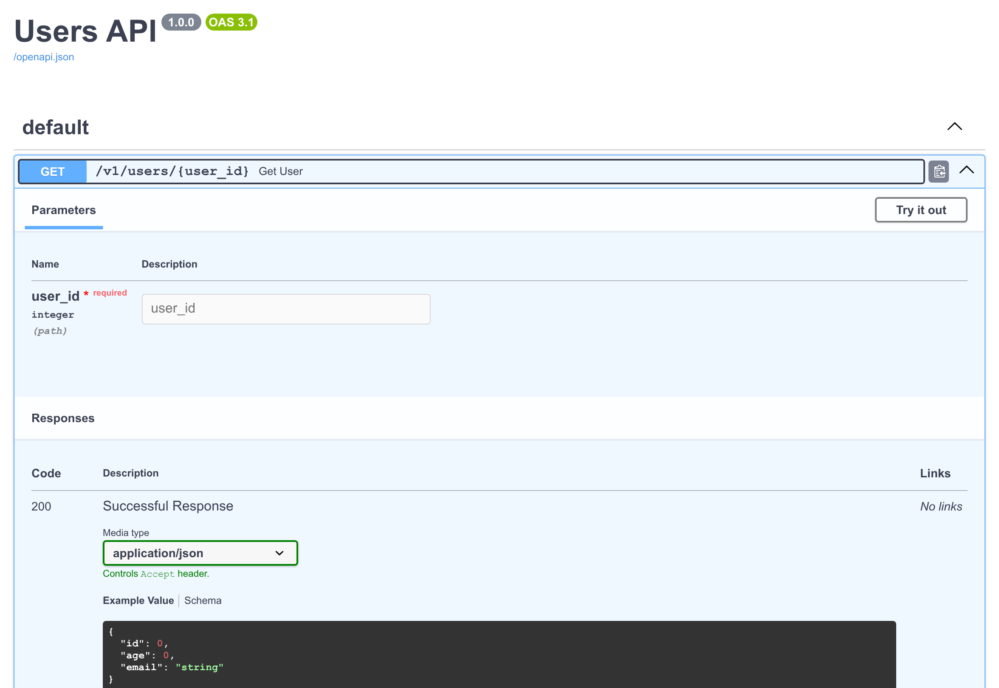

\clearpage

# Abstract {.unnumbered}

Python's static type system cannot express types produced by metaprogramming, yet dynamically manipulating classes has been a native feature of the language since day one.

PEP 827 (*Type Manipulation*, Draft, targeting Python 3.16) proposes type manipulation facilities to close this gap, but whether they are sufficient in practice was unknown. This thesis answers that question empirically by building **tysql**, a PostgreSQL query builder whose result types are statically inferred from the queries themselves — a capability previously unattainable in Python. On a defined query subset the inferred types are verified against a live PostgreSQL server as an external oracle, and the limits beyond that subset are mapped precisely.

tysql is usable today:

- it statically infers the result type of every supported SQL statement and rejects ill-typed statements with a type error, using the type operators of PEP 827;
- because released type checkers do not support PEP 827 yet, it ships a CLI validator that reports errors in the same places any checker will once PEP 827 lands.

The project is open source: the code lives at <https://github.com/iliyasone/tysql>, the package is published on PyPI as [`tysql`](https://pypi.org/project/tysql/), and the examples of this thesis can be tried in the browser at <https://tysql.vercel.app>.

\clearpage

# Аннотация {.unnumbered}

Статическая система типов Python не способна выразить типы, порождаемые метапрограммированием, хотя динамическое манипулирование классами было встроенной возможностью языка с самого его появления.

PEP 827 (*Type Manipulation*, статус Draft, целевая версия — Python 3.16) предлагает средства манипуляции типами, призванные закрыть этот пробел, однако достаточно ли их на практике, оставалось неизвестным. В настоящей работе на этот вопрос даётся эмпирический ответ: построен **tysql** — конструктор запросов к PostgreSQL, типы результатов которого статически выводятся из самих запросов, что прежде было недостижимо в Python. На выделенном подмножестве запросов выведенные типы сверяются с реальным сервером PostgreSQL, выступающим в роли внешнего оракула, а границы применимости за пределами этого подмножества точно очерчены.

tysql пригоден к использованию уже сегодня:

- он статически выводит тип результата каждого поддерживаемого SQL-запроса и отвергает некорректно типизированные запросы, сообщая об ошибке типов, — с помощью операторов типов из PEP 827;
- поскольку статические типизаторы пока не поддерживают PEP 827, в состав пакета входит CLI-валидатор, который сообщает об ошибках в тех же местах, где их будет отмечать любой типизатор после принятия PEP 827.

Проект имеет открытый исходный код: код доступен по адресу <https://github.com/iliyasone/tysql>, пакет опубликован на PyPI под именем [`tysql`](https://pypi.org/project/tysql/), а примеры из данной работы можно опробовать в браузере по адресу <https://tysql.vercel.app>.

\clearpage

# Introduction

Python's type system is Turing-complete, yet in everyday use it is far less expressive than the language it describes. Classes are created, inspected, and rewritten while the program runs; the type system was added much later and has been catching up ever since. That history shows up as three ways type information is *used*, each building on the one before it.

**Metaprogramming came first.** Long before type hints, Python already rewrote classes at runtime. `enum.Enum` is the clearest case: its metaclass turns plain class-body assignments into singleton member objects.

```python
class Color(enum.Enum):
    RED = 1
    GREEN = 2
    BLUE = 3
```

`EnumMeta` rewrites the body, so an assignment like `RED = 1` no longer holds the integer `1` but a distinct `Color` member. The interactive shell shows what each name became:

```python
>>> Color.RED
<Color.RED: 1>
>>> Color.RED.name, Color.RED.value
('RED', 1)
>>> list(Color)
[<Color.RED: 1>, <Color.GREEN: 2>, <Color.BLUE: 3>]
>>> Color(99)
ValueError: 99 is not a valid Color
```

With no static checking at all, an enum already provides a distinct object rather than a bare `int`, identity comparison, a readable `repr`, `.name` and `.value`, iteration, and runtime rejection of invalid values. The static benefit — a checker enforcing `def paint(c: Color)` and proving a `match` exhaustive — arrived later, with PEP 484. It was a bonus, not the original reason.

**Static checking came next.** Type hints added a second layer that a checker reads and then erases. Because the checker knows `c` is a `Color`, it can prove the `match` below covers every member, with no fallback case:

```python
def is_warm(c: Color) -> bool:
    match c:
        case Color.RED:
            return True
        case Color.GREEN | Color.BLUE:
            return False
    typing.assert_never(c)
```

The closing `assert_never(c)` makes the guarantee explicit: it type-checks only because the checker has narrowed `c` to `Never`, proving every member is handled. Add a fourth color without a branch and `c` is no longer `Never`, so `assert_never` is flagged as a static error.

**Annotations live at runtime, too.** A class is itself an ordinary runtime object,

```python
>>> int
<class 'int'>
```

and an annotation is a reference to such an object. Python keeps annotations in the object model, so libraries can read them back and act on them:

```python
>>> is_warm.__annotations__
{'c': <enum 'Color'>, 'return': <class 'bool'>}
>>> is_warm.__annotations__['c'](1)
<Color.RED: 1>
```

The annotation for `c` is the runtime object class `Color`. It can even be called to construct a member. The brightest example of this is FastAPI, which reads a route's signature to validate requests and to generate its API documentation:

```python
from fastapi import FastAPI
from pydantic import BaseModel

api = FastAPI()


class User(BaseModel):
    id: int
    age: int
    email: str


@api.get("/v1/users/{user_id}")
def get_user(user_id: int) -> User: ...
```

From nothing but these annotations, FastAPI derives the interactive documentation in Fig. 1 — the path, the `user_id` parameter, and the full `User` response schema.

{ width=88% }

## Current gap

A decade of work has made Python's annotations remarkably capable. Yet one class of types still escapes them: the result of a database query. SQLAlchemy is at once the clearest showcase of annotation-driven runtime behaviour and the clearest demonstration of where it stops.

A relational database stores rows of named, typed columns across related tables. The motivating schema has three (Fig. 2): every post and comment belongs to a user, and every comment belongs to a post. (The implementation chapter later works over a focused two-table slice of this schema — users and posts.)

\begin{figure}[H]
\centering
\begin{tikzpicture}[
  font=\small,
  entity/.style={rectangle, draw, thick, inner sep=4pt, fill=gray!4},
  rel/.style={draw, thick, -{Stealth[length=2mm, width=2mm]}},
]
\node[entity] (users) {%
  \begin{tabular}{@{}l@{\hspace{1.6em}}l@{}}
    \multicolumn{2}{@{}l@{}}{\bfseries users}\\ \hline
    \textit{PK} & id\\ \hline
     & email\\
     & registered\_at\\
  \end{tabular}};
\node[entity, right=20mm of users] (posts) {%
  \begin{tabular}{@{}l@{\hspace{1.6em}}l@{}}
    \multicolumn{2}{@{}l@{}}{\bfseries posts}\\ \hline
    \textit{PK} & id\\
    \textit{FK} & author\_id\\ \hline
     & created\_at\\
  \end{tabular}};
\node[entity, right=20mm of posts] (comments) {%
  \begin{tabular}{@{}l@{\hspace{1.6em}}l@{}}
    \multicolumn{2}{@{}l@{}}{\bfseries comments}\\ \hline
    \textit{PK} & id\\
    \textit{FK} & post\_id\\
    \textit{FK} & author\_id\\ \hline
     & created\_at\\
  \end{tabular}};
\draw[rel] (posts.west) -- node[above, font=\footnotesize]{author\_id} (users.east);
\draw[rel] (comments.west) -- node[above, font=\footnotesize]{post\_id} (posts.east);
\draw[rel] (comments.south) -- ++(0,-7mm) -| node[pos=0.25, below, font=\footnotesize]{author\_id} (users.south);
\end{tikzpicture}
\caption{The example schema. \texttt{posts} and \texttt{comments} reference \texttt{users}, and \texttt{comments} reference \texttt{posts}, by foreign key.}
\end{figure}

How such a table is declared in Python changed fundamentally between SQLAlchemy's two eras (Fig. 3). The 2008 style kept a column's type in the assigned *value*, `Column(Integer)`, with no annotation on the attribute. The 2.0 redesign (2023) moved the type into the *annotation* `Mapped[int]` and reads it back at runtime to build the mapper — so the annotation stopped being a passive hint and started changing runtime behaviour, and a checker now reads `User.id` as `int`. This is runtime introspection of annotations at its most ambitious.

\begin{figure}[H]
\centering
\begin{minipage}[t]{0.46\linewidth}
\centering
\textbf{\small SQLAlchemy 0.x (2008)}\\[4pt]
\begin{Verbatim}[fontsize=\small, frame=single, framesep=5pt]
class User(Base):
    id = Column(Integer)
    email = Column(String)
\end{Verbatim}
\end{minipage}\hfill
\begin{minipage}[t]{0.46\linewidth}
\centering
\textbf{\small SQLAlchemy 2.0 (2023)}\\[4pt]
\begin{Verbatim}[fontsize=\small, frame=single, framesep=5pt]
class User(Base):
    id: Mapped[int]
    email: Mapped[str]
\end{Verbatim}
\end{minipage}
\caption{The same \texttt{users} table in SQLAlchemy 0.x (2008, left) and 2.0 (2023, right): the column's type moves out of the runtime \emph{value} \texttt{Column(Integer)} and into the \emph{annotation} \texttt{Mapped[int]}, which 2.0 reads back to build the column.}
\end{figure}

And yet the gap survives exactly here. A query that projects specific columns loses the column names from its type:

```python
row = session.execute(select(User.id, User.email)).one()
reveal_type(row[0])
reveal_type(row.id)
```

A checker reports `int` for `row[0]` but `Any` for `row.id`: the value is typed only by position, never by name. SQLAlchemy 2.0 gives this projection the type `Row[tuple[int, str]]` — the column names are gone.

A subtler version of the same blind spot appears with relationships. Once the foreign keys of Fig. 2 are declared as ORM relationships, they can be traversed as ordinary attributes:

```python
class User(Base):
    posts: Mapped[list[Post]] = relationship()


class Post(Base):
    author: Mapped[User] = relationship()
    comments: Mapped[list[Comment]] = relationship()
```

Now select a single post and follow the relationships back out:

```python
post = session.scalars(select(Post).where(Post.id == 1)).one()
reveal_type(post.author.posts[0].comments)
```

The checker resolves `post.author.posts[0].comments` to `list[Comment]` — every link is a declared relationship, so the entire chain type-checks. But `select(Post)` fetched a single `posts` row; the post's `author`, that author's other `posts`, and their `comments` were never loaded. The static type asserts a fully materialised object graph the query never produced — at runtime each step either fires another query (lazy loading) or raises on a closed session. Nothing in the result type records what a query actually fetched.

Both failures share one root: the result type is declared up front, never computed from the query that produces it. Computing it from the query instead — so a `SELECT` yields a precise record such as `{"id": int, "email": str}`, naming exactly the columns it returns, and an ill-typed query becomes a type error — is what PEP 827's type manipulation makes possible [12], and what the rest of this thesis builds and measures.

## Research question and contributions

The proposal is new, and its central promise — that a *fixed* set of type-level operators can express the value-dependent types real libraries need — has not been tested against a demanding domain. This thesis takes SQL as that domain and asks, concretely:

- **RQ.** To what extent can PEP 827's type-manipulation facilities *well-type* a subset of PostgreSQL? A query is *well-typed* when the checker infers its exact result type — a record whose keys and value types match the columns PostgreSQL actually returns — and rejects the statement exactly when PostgreSQL would. Two sub-questions follow: which queries have a result type the facilities *cannot* infer, and which ill-typed queries *cannot* be statically rejected?

The answer is delivered as an artefact and an evaluation. The artefact is **tysql**, a query builder in which each statement is a type and its parameters and result rows are computed from that type by PEP 827 combinators. The evaluation defines a subset **S**, runs each query class against a real PostgreSQL server, and reports — reproducibly — where the inferred type is *exact*, where it is only *approximate*, and where the facilities are *not enough*. The specific contributions are:

1. a type-level PostgreSQL builder that infers the result record of every statement in **S** and rejects out-of-schema references at check time (§*tysql: implementation and evaluation*);
2. a **dual-track methodology** that keeps a runtime evaluator and a static checker in lock-step, with negative assertions that fail loudly when a check stops firing (§*Design and methodology*);
3. a **PostgreSQL-oracle evaluation** that confirms exact inference across **S** and pins down the three walls beyond it — inexpressible aggregates and outer-join nullability, collapsing duplicate names, and unsound value comparison (§*tysql: implementation and evaluation*);
4. concrete feedback for standardisation, including fixes to PEP 827's reference tooling — one already merged — and an account of what acceptance requires (§*Analysis and discussion*).

The thesis is organised accordingly. *Literature review* places the work against Python's typing philosophy, the two ways other languages type SQL, and the proposal itself. *Design and methodology* introduces PEP 827's combinators, the two-evaluator (runtime/static) setup, the paired-test discipline that keeps them honest, and PostgreSQL-as-oracle. *tysql: implementation and evaluation* builds the query builder family by family and then measures it against the oracle. *Analysis and discussion* reads the results into the live debate over the proposal, and *Conclusion* summarises the answer and the road to standardisation.

# Literature review

This chapter situates the work against three bodies of knowledge: Python's own typing philosophy and why it stops short of value-dependent types; how other languages already type SQL, which divides cleanly into two strategies; and the specific proposal — PEP 827 — this thesis evaluates, together with the earlier features its implementation stands on.

## Python's typing philosophy: portable, optional, first-order

Python's type hints are optional and tool-oriented: PEP 484 frames them as a notation for offline static analysis, not a mechanism that changes runtime semantics [1]. Because the same annotations are consumed by several independent checkers, *portability* is a first-order constraint — a guarantee that depends on one checker's internals is not a guarantee in Python's ecosystem [1]. PEP 544 adds structural subtyping through `Protocol`, but only *constrains* existing objects; it cannot *construct* new types whose shape depends on runtime values [2]. PEP 681's `dataclass_transform` goes further by standardising a *declarative marker*: it performs no transformation itself, it only tells checkers to treat a class as dataclass-like [3]. The recurring choice is visible across all three — the ecosystem standardises a fixed signal, never type-level computation.

Most hard Python typing problems share one cause: the type depends on runtime values, and the shared annotation language has no portable way to express that dependency. A typed projection makes this concrete. TypeScript builds the result type from the inputs with the `Pick` operator and `const` assertions, so selecting a subset of columns yields a precisely typed record [4][5]. Python performs the same projection at runtime trivially, but cannot *name* the resulting type as a function of the selected keys [1]. The same limit appears with intersection and negation, which are not standardised as user-denotable operators even though narrowing arguments are naturally set-theoretic [6]; different checkers approximate them with incompatible internal rules, fragmenting the effective type system [7].

Crucially, expressiveness is not the obstacle. Roth shows Python's type system is already Turing-complete: arbitrary computation can be encoded into subtyping [11]. The limitation is not power but the absence of a *designed, readable, portable* surface for value-dependent type relationships — the gap PEP 827 targets and this thesis measures.

## Two ways to type SQL

SQL is the sharpest test of value-dependent typing: a query's result type is a function of the query text and the schema, and getting it wrong is a common source of runtime errors. Languages that type SQL fall into two families.

**Code generation — types produced by an external step.** Rust's `sqlx` verifies a SQL string *against a live database at compile time* and expands the query macro into an anonymous struct with typed fields:

```rust
// sqlx: the string is checked against the DB at compile time; the row struct
// (id: i32, email: String) is generated from the database's own metadata.
let rows = sqlx::query!("SELECT id, email FROM users WHERE age > $1", 18)
    .fetch_all(&pool).await?;
```

Prisma takes the same idea from a schema file rather than a live connection: `prisma generate` reads a `.prisma` schema and emits a fully typed TypeScript client, so a projection is typed by generated code [21].

```typescript
// Prisma: `prisma generate` produced the client's types from the schema.
const rows = await prisma.user.findMany({ select: { id: true, email: true } });
//    rows : { id: number; email: string }[]
```

Go's `sqlc` is the same strategy without an ORM: it reads hand-written SQL text and the schema and *compiles* them to type-safe Go — structs and methods whose result fields are generated from the query [27]. All three are effective and all pay the same price: a build step, a generated artefact that can drift from source, and — for `sqlx` — a database reachable at compile time [22]. The types are correct but they are not written in, or computed by, the host language's own type system.

**Type-level embedding — the host language computes the *result type*.** The distinguishing axis is not whether a schema is ever generated but *who computes the type of a query's result*. Rust's Diesel encodes the schema in a `table!` macro (which its tooling can generate from the database) but then lets the trait system infer *result types* directly — a `select` of two columns yields a `(i32, String)` the compiler derives, not a struct emitted by a generator [19]:

```rust
// Diesel: the trait system derives the result type (i32, String) at compile time.
let rows: Vec<(i32, String)> =
    users.filter(age.gt(18)).select((id, email)).load(&mut conn)?;
```

Haskell's Squeal goes furthest: the schema *is* a type, and a query is a typed expression whose result row is computed by the type checker, so an out-of-schema column or a shape mismatch is a type error in ordinary Haskell [20]. This second family — a SQL DSL embedded in the host language, whose *result types* are computed by that language's type system rather than emitted by an external generator — is precisely what Python has lacked.

The qualifier matters, because Python is not short of typed-SQL *libraries*; it is short of ones that *compute* the result type. SQLModel — a single model class layered over Pydantic and SQLAlchemy — gives a table a set of typed fields, but a query's result shape is the model class the programmer *declares*, not a type derived from the columns a `SELECT` projects [28]. Piccolo, an async ORM and query builder with fully typed columns, is the same story a step further: its query API is richly annotated, yet the shape a query *returns* is still a declared model or a plain `dict`, not a record the type system builds from the selection [29]. Both are ergonomic, and both stop exactly where tysql begins — at making the result type a function of the query. PEP 827 is what would let Python join the embedding family, and tysql is this thesis's test of whether it can.

## The features tysql stands on

tysql is not built on PEP 827 alone; it composes several recently standardised typing features, each load-bearing:

- **PEP 695** — type parameter syntax — gives the `class Column[Owner, Name, T]` and `type Alias[T] = …` forms used throughout, and the concise `type` statement that carries the combinator programs [17].
- **PEP 646** — variadic generics (`TypeVarTuple`, `Unpack`) — lets a statement carry a variable-length list of modifiers, as in `Select[Src, *Mods]` and `Insert[T, *Mods]` [15].
- **PEP 692** — `Unpack` of a `TypedDict` for `**kwargs` — is the natural way to type an `INSERT`'s keyword arguments, and its interaction with PEP 827 is where one concrete wall appears: a *computed* `TypedDict` cannot be consumed as `**kwargs` (documented in the appendix) [16].
- **PEP 649/749** — deferred evaluation of annotations — means, from Python 3.14, that annotations are lazy expressions rather than eagerly evaluated objects; this is what makes runtime interpretation of a combinator program by `typemap` viable at all [18].

The through-line is that Python has spent a decade shipping *fixed, declarative* typing features. PEP 827 is the first to standardise type-level *computation* over them.

## PEP 827 and its reference tooling

PEP 827, *Type Manipulation* [12], is the proposal under evaluation. It is a **Draft** and targets **Python 3.16** — a status that matters here as a constraint, not a footnote: no released type checker implements it, so a proof of practicality cannot lean on production tooling and must instead demonstrate the facilities working end to end on prototype implementations. Two such implementations exist and are the substrate of this work: `typemap`, a runtime evaluator of the combinators [13], and a fork of `mypy` that evaluates them during type-checking [14]. This thesis uses the author's fork of `typemap` (the runtime track) and the `mypy` fork (the static track); the differential-testing methodology of the next chapter is, in effect, a conformance check of these two prototypes against each other.

Where the standard surface has fallen short before, Python libraries reached for checker *plugins*. Mypy's plugin system exists precisely to teach the checker about patterns the annotation language cannot express [8]. SQLAlchemy shows both the value and the cost: its mypy plugin added precision for declarative mappings, then became a maintenance liability and was deprecated in 2.0 in favour of native annotations [9][10]. A plugin is also inherently non-portable — it is one checker's internal extension, exactly the guarantee PEP 484 warns against relying on [1]. PEP 827's ambition is to move this capability from per-library, per-checker plugins to a *shared, spec-able surface* every checker can implement — the same trajectory PEP 681 followed for the narrow case of dataclasses [3]. Whether the surface it proposes is expressive enough for a real domain is the open question this thesis takes up.

# Design and methodology

## Two meanings of an annotation: `typing.TYPE_CHECKING`

`typing.TYPE_CHECKING` is a constant that is `True` while a type checker analyses the code and `False` when the program runs. It was introduced for lazy imports and forward references, but it also lets a name exist for the checker and not at runtime — which is exactly where the two readings of an annotation come apart:

```python
if typing.TYPE_CHECKING:

    class Hidden:
        value: int


def build() -> Hidden:
    return Hidden()
```

The checker accepts `build` — `Hidden` is in scope statically — yet the class is never defined at runtime, so calling `Hidden()` raises `NameError`. A meta-type can therefore carry a precise static meaning with no runtime counterpart, and (as later sections show) the reverse. Trusting either reading alone is unsafe. This is the founding assumption of the methodology: because the two readings can diverge, every claim in this thesis is checked on *both* — never inferred from one.

## PEP 827 in one page

Before the combinator catalogue, the one idea underneath all of them. A type checker's usual job is to *check* a type the programmer already wrote down; PEP 827's job is to let the programmer *compute* one. It gives the annotation language two powers it never had. The first is **construction**: `NewTypedDict[*Members]` and `NewProtocol[*Members]` build a genuinely new type — a record or a structural interface that appears in no source file — from a list of fields computed at the type level. The second is **inspection**: `Attrs`, `GetMemberType`, `GetArgs`, `Length` read structure back out of an existing type, so a computed type can be derived from one the programmer already has. Construction and inspection compose: one can take a class apart, transform its members, and reassemble a new type from the pieces — all before the program runs. Two lines make the shape concrete (Fig. 4): the left column is a *type-manipulation statement* — a perfectly ordinary generic alias — and the right column is the type a PEP 827-aware checker resolves it to.

\begin{figure}[H]
\centering
\begin{minipage}[t]{0.54\linewidth}
\centering
\textbf{\small type-manipulation statement}\\[4pt]
\begin{Verbatim}[fontsize=\small, frame=single, framesep=5pt]
# inspect an existing type
GetMemberType[User, Literal["id"]]

# construct a new type
NewTypedDict[
  Member[Literal["id"], int],
  Member[Literal["name"], str],
]
\end{Verbatim}
\end{minipage}\hfill
\begin{minipage}[t]{0.38\linewidth}
\centering
\textbf{\small resolves to}\\[4pt]
\begin{Verbatim}[fontsize=\small, frame=single, framesep=5pt]
int


class _(TypedDict):
  id: int
  name: str

\end{Verbatim}
\end{minipage}
\caption{A type-manipulation statement (left) and the type it resolves to (right): \texttt{GetMemberType} \emph{inspects}, reading a member's type back out of \texttt{User}; \texttt{NewTypedDict} \emph{constructs}, assembling a record type that appears in no source file. Both are ordinary generic aliases the checker knows how to evaluate.}
\end{figure}

The gap the introduction ends on — a type that must be *computed* from a query — is exactly what PEP 827 [12] sets out to make expressible. It adds no new syntax; it adds a set of *type-level combinators*, ordinary generic aliases that a type checker knows how to evaluate. The ones this thesis leans on are few:

- `Attrs[T]` and `Iter[…]` enumerate the members of a class at the type level, so an alias can loop over a schema's columns;
- `Member[name, type]` builds one field, and `NewTypedDict[*Members]` assembles those fields into a fresh `TypedDict` — this is how a result record is *constructed* rather than declared;
- `GetArg`, `GetArgs`, `GetMemberType`, `Length`, `Slice` read structure back out of a type (an argument by index, a member's type, the length of an argument list);
- `IsAssignable` and `IsEquivalent` are the type-level predicates, each evaluating to `Literal[True]` / `Literal[False]`, usable in a `type` alias's conditional expression;
- `UpdateClass[*Members]`, used as the return annotation of `__init_subclass__`, tells the checker to *rewrite* a class's members — the mechanism that turns a plain column annotation into a rich `Column`;
- `RaiseError[Literal["msg"]]` produces a type that, when evaluated, surfaces a diagnostic — the proposal's designated way to signal an ill-formed type (its role, and why the bottom type `Never` cannot play it, is examined in *Analysis and discussion*).

A small example shows the shape of the whole idea. The alias below loops over a class's attributes and rebuilds them as a `TypedDict`, keeping every name but wrapping each value type:

```python
type Wrap[T] = t.NewTypedDict[
    *[t.Member[x.name, Boxed[x.type]] for x in t.Iter[t.Attrs[T]]]
]
```

Nothing here is a value being computed at runtime in the ordinary sense; it is a *type* being computed, by rules the checker follows. PEP 827 is a Draft targeting Python 3.16 [12], so no released checker evaluates these rules yet — which is the practical problem the next section addresses.

## Two evaluators for one language

That problem is narrower than it sounds, because the proposal is not a paper design. Its authors ship reference tooling on both sides of Python's typing divide: a runtime evaluator, `typemap`, and a fork of `mypy` that implements the static rules, the latter authored by the PEP's own lead author [14]. This thesis builds directly on that tooling — running the same combinator language through both evaluators, using the author's own forks of each [13][14], and requiring the two to agree.

- **The runtime track — `typemap`.** Annotations are first-class objects, so the combinators can be interpreted at run time. `typemap`'s `eval_typing(Wrap[User])` walks the alias and returns an actual `TypedDict` class, with real `__annotations__` and `__required_keys__` [13]. This is the track a program can use *today*, with no special checker, and the track the runtime tests introspect directly. The result is a real class one can inspect at the prompt — `typemap` even ships a display helper, `format_class`, that prints the computed type back as source:

```python
>>> td = eval_typing(Wrap[User])
>>> td.__annotations__
{'id': Boxed[int], 'age': Boxed[int], 'email': Boxed[str]}
>>> td.__required_keys__
frozenset({'email', 'id', 'age'})
>>> print(format_class(td))
class Wrap[User]:
    id: Boxed[int]
    age: Boxed[int]
    email: Boxed[str]
```

- **The static track — a `mypy` fork.** A fork of `mypy` evaluates the very same aliases during type-checking, so a call site like `run(Select[User], data=…)` is validated with no runtime call at all [14]. This is the experience PEP 827 promises once standardised, available now to anyone who installs the fork.

The two are not redundant. The static track is where the proposal's real value lies — errors before the program runs — but it is also where the fork's incompleteness bites, and several design decisions in tysql exist only because a construct that evaluates cleanly at runtime does *not* survive the fork (§*tysql: implementation and evaluation* returns to this repeatedly). The runtime track is complete enough to serve as a second opinion and as a fallback distribution channel. Holding a feature to *both* is what makes a green build meaningful (Fig. 5).

\begin{figure}[H]
\centering
\begin{tikzpicture}[
  font=\small, node distance=6mm,
  box/.style={rectangle, draw, thick, rounded corners, inner sep=5pt, fill=gray!4, align=center},
  db/.style={rectangle, draw, thick, inner sep=5pt, fill=blue!5, align=center},
  op/.style={-{Stealth[length=2mm]}, thick},
]
\node[box] (src) {one combinator program\\\texttt{ResultOf[Select[User, ...]]}};
\node[box, above right=5mm and 20mm of src] (rt) {runtime track\\\texttt{typemap.eval\_typing}};
\node[box, below right=5mm and 20mm of src] (st) {static track\\\texttt{mypy} fork};
\node[box, right=18mm of rt] (rtd) {\texttt{TypedDict}\\(introspected)};
\node[box, right=18mm of st] (std) {revealed type\\(\texttt{assert\_type})};
\node[box, right=14mm of $(rtd)!0.5!(std)$] (agree) {paired tests:\\\textbf{must agree}};
\node[db, below=9mm of agree] (pg) {PostgreSQL\\(oracle)};
\draw[op] (src.north) to[out=50,in=180] (rt.west);
\draw[op] (src.south) to[out=-50,in=180] (st.west);
\draw[op] (rt) -- (rtd);
\draw[op] (st) -- (std);
\draw[op] (rtd.east) to[out=0,in=90] (agree.north);
\draw[op] (std.east) to[out=0,in=-90] (agree.south);
\draw[op] (agree) -- node[right, font=\footnotesize]{ground truth} (pg);
\end{tikzpicture}
\caption{The dual-track methodology. One combinator program is evaluated two independent ways --- interpreted at runtime by \texttt{typemap} and type-checked by the \texttt{mypy} fork --- and paired tests require the two results to agree. For the query subset, a live PostgreSQL adds a third, external check on whether the agreed type is actually correct.}
\end{figure}

## Why two evaluators, and not one: annotations as lazy runtime values

Running one program through two evaluators is not a defensive redundancy; it is forced by what a Python annotation *is*. Python's types are ordinary runtime values, and an annotation is an ordinary Python expression that denotes one. A type-manipulation statement therefore has to be meaningful in two genuinely different worlds at once: a static tool reading the *source* at lint time, and the interpreter evaluating the *object* at runtime — the moment a library introspects `__annotations__`. Neither world is privileged; a construct is only trustworthy when it behaves the same in both. That is the whole reason the methodology pairs the two tracks rather than trusting either alone.

That an annotation can be a live runtime object at all — rather than a string — is a recent and hard-won property. Before Python 3.14, annotations were evaluated *eagerly*, at the moment a class, function, or module was defined. This made a self-referential class impossible to write directly:

```python
class Node[T]:
    value: T
    left: Node[T]
    right: Node[T]
```

Under eager evaluation the annotation `Node[T]` runs while the body of `Node` is still executing — before the name `Node` is bound in the enclosing namespace — and raises `NameError: name 'Node' is not defined`. The community's escape hatch was PEP 563, *Postponed Evaluation of Annotations* (2017, available from Python 3.7 via `from __future__ import annotations`) [25], which stored annotations as *strings* rather than evaluating them. That dissolved the circularity — `Node[T]` became the harmless string `'Node[T]'` — but at a cost that matters precisely here: it threw away the real runtime objects. The whole premise of introspection-driven libraries (SQLAlchemy 2.0, FastAPI, Pydantic) is that an annotation *is* a usable class at runtime, not text to be re-parsed.

Python 3.14 resolves the tension without either sacrifice. PEP 649, with its implementation refined by PEP 749 [18], makes annotations **lazy** rather than string-valued: the compiler stores the annotation expressions in a per-object `__annotate__` function that is called only when the annotations are actually accessed. The `Node` class above now defines cleanly, and yet `Node.__annotations__` still yields the *real* generic alias `Node[T]`, not a string. Annotations stay first-class runtime objects — which is exactly what lets `typemap` interpret PEP 827 combinators at runtime — while forward references and self-reference simply work. The two evaluators of Fig. 5 are the two lawful readings of that single lazy object, and holding them equal is what the rest of this chapter operationalises.

## Testing both paths

The two tracks do drift in practice. A representative case from this project's own suite is the primary-key filter behind the insert machinery: the guard `IsAssignable[x.type, Column[Any, Any, SerialPrimaryKey[Any]]]` is static-clean, but `typemap`'s runtime `IsAssignable` treats the `Any` owner and name slots as matching *every* column, so at runtime the filter rejects all of them and collapses the synthesised record to an empty `TypedDict` — here the runtime track is at fault, and the case is pinned by `xfail(strict=True)` tests. Most drift is like this: a bug in one of the two prototype evaluators, and therefore closeable; pairing the tracks is exactly what surfaces it.

One kind of drift, however, is not a bug and cannot be closed: a name that exists only under `if typing.TYPE_CHECKING:` has a static meaning with *no runtime object at all*, so the runtime track has nothing to cross-check. This motivates a position the author holds and states as such: in a post-3.14 world of lazy annotations — where circular imports and forward references, the historical reasons to hide a name from the runtime, no longer require `TYPE_CHECKING` — and especially in a post-PEP-827 world, where the annotation language can compute the types that once had to be smuggled in statically, `typing.TYPE_CHECKING` should be regarded as a code smell: it is the one construct that makes the two readings of a program provably, and permanently, unequal.

Every feature is therefore exercised twice, by two adjacent functions over the same definition. The static half is type-only: its body lives under `if TYPE_CHECKING:`, so it never runs, but the checker still reads it, and `assert_type` states the expected type. The runtime half evaluates the same definition with `typemap`'s `eval_typing` and inspects the result directly. (`t.NewTypedDict` / `t.Member` are PEP 827 combinators that build a `TypedDict` at the type level; `eval_typing` is `typemap`'s runtime evaluator of the same expression.)

```python
type Row = t.NewTypedDict[t.Member[Literal["a"], int], t.Member[Literal["b"], str]]


def mypy_test_row() -> None:
    if typing.TYPE_CHECKING:
        row: Row = {"a": 1, "b": "x"}
        assert_type(row["a"], int)


def test_row() -> None:
    td = eval_typing(Row)
    assert td.__annotations__ == {"a": int, "b": str}
```

`mypy_test_row` is checked but never collected by pytest (the `mypy_` prefix); `test_row` runs the same `Row` through the runtime evaluator. One definition, both meanings, side by side.

Because the fixtures are ordinary Python, the editor, CI, and the runtime evaluator all see the same code, with the project's real imports and library context in scope — and no separate mypy subprocess is spawned to type-check a snippet. The trade-off is apparent rather than real: the tests do not drive mypy themselves, so it can look like less control over the checker; in practice it is enough, and it keeps the unit under test identical to ordinary library code.

## Honest negative tests

Positive assertions are easy; the hard half is proving that a malformed input is *rejected*, because a missing diagnostic is silent. Two mypy flags turn a suppression comment into a checked assertion:

```python
def mypy_test_row_rejects_bad() -> None:
    if typing.TYPE_CHECKING:
        row: Row = {"a": "oops", "b": "x"}  # type: ignore[typeddict-item]
```

Under `--enable-error-code ignore-without-code` every `# type: ignore` must name its code, and `--warn-unused-ignores` fails the run if the named error is no longer emitted. So `# type: ignore[typeddict-item]` asserts *"mypy must still flag this line"*: the day the negative case silently starts type-checking, the ignore becomes unused and CI turns red. `pytest.mark.xfail(strict=True)` gives the runtime track the same property for known static/runtime divergences — it flips to a failure the moment the gap closes.

## The iceberg beneath a type-manipulation statement

A type-manipulation statement looks innocent — a generic alias, an `if`/`else`. Beneath that surface sit successive layers of subtlety, each invisible until the one above it is understood. It is worth descending through them deliberately; call the whole structure the *iceberg* (Fig. 6), and take one small statement down through it:

```python
type X = int if t.Bool[Literal[True]] else str
```

\begin{figure}[H]
\centering
\begin{tikzpicture}[font=\small]
  \fill[blue!8] (-4.2,0) rectangle (4.2,-4.6);
  \draw[blue!45, thick] (-4.2,0) -- (4.2,0);
  \node[anchor=west, font=\footnotesize] at (-4.15,0.22) {waterline: what the reader sees};
  \fill[gray!12, draw=gray!55, thick] (0,1.3) -- (-1.1,0) -- (1.1,0) -- cycle;
  \node[font=\footnotesize, align=center] at (0,0.55) {\textbf{syntax}};
  \fill[gray!18, draw=gray!55, thick] (-1.1,0) -- (1.1,0) -- (2.3,-1.5) -- (-2.3,-1.5) -- cycle;
  \node[font=\footnotesize, align=center] at (0,-0.85) {\textbf{lazy $\neq$ inert}};
  \fill[gray!24, draw=gray!55, thick] (-2.3,-1.5) -- (2.3,-1.5) -- (3.5,-3.4) -- (-3.5,-3.4) -- cycle;
  \node[font=\footnotesize, align=center] at (0,-2.4) {\textbf{the conditional hazard}\\naive introspection commits\\to the wrong branch};
\end{tikzpicture}
\caption{The iceberg. Only the syntax breaks the surface; correctness depends on the layers below it --- that a type alias is evaluated lazily but reduced by nobody (\emph{inert}), and that a naive runtime reading of a conditional silently takes the wrong branch.}
\end{figure}

### Layer 1 — the surface: it must be valid Python

The tip of the iceberg is syntax. A type-manipulation statement is not a separate notation; it is an ordinary Python expression the interpreter must be able to evaluate into an object — that is the whole point of the previous section. This is precisely why the notation is verbose. One cannot write `(int, 1 | 2)` to mean `tuple[int, Literal[1] | Literal[2]]`, because Python evaluates that expression literally — as a 2-tuple whose second element is the integer `3` (`1 | 2` is a bitwise *or*). To stay evaluable, the intent must be spelled out:

```python
# What we would like to write vs. what Python already means:
#   (int, 1 | 2)  ->  a 2-tuple whose second element is the integer 3
type Pair = tuple[int, Literal[1] | Literal[2]]
```

The surface *may* improve later. A draft proposal — *AST Format for Annotation Functions* — would let annotation functions return the annotation's abstract syntax tree instead of its evaluated value, so a checker could read `1 | 2` structurally [26]. But this does not undercut the combinator approach; it reinforces it. Because an annotation must ultimately be an introspectable runtime object, any nicer surface syntax would still have to *lower* to the same objects `NewTypedDict`, `Member`, and friends already denote. Writing evaluable combinators from day one is therefore not a stopgap: it is committing to the layer everything else must compile down to anyway.

### Layer 2 — lazy is not inert

One level down. Because annotations are lazy since Python 3.14, the alias `X` above is not evaluated until something accesses it — in Python 3.14 the access points are `X.__value__` (the lazily computed, cached property) and the lower-level `X.evaluate_value()` method behind it.

But laziness is only half the story, and conflating it with the other half is the trap. PEP 827 types are also **inert**: evaluating one does *not* reduce it. Accessing an inert combinator yields the combinator, not its answer — `Length[…]` does not become an `int`, and `IsAssignable[…]` does not become `Literal[True]`. This is a deliberate design decision in PEP 827: most of its extensions to the type system are, in the proposal's own words, "inert" type operator applications [12]. *Lazy* concerns *when* an annotation is evaluated; *inert* concerns *whether evaluation reduces it*. An annotation can be fully evaluated and still not be reduced.

Reduction is somebody else's job, and there are exactly two parties equipped to do it: a static type checker, which has the reduction rules built in; or a runtime introspection library, which must reduce explicitly through an evaluator such as `typemap.type_eval.eval_typing`. The author's position is that this second party should not have to reach for a third-party package: a reference evaluator arguably belongs in the standard library, as part of the language specification, so that "reduce this inert type" has one canonical meaning rather than one per library.

### Layer 3 — the conditional hazard

The bottom layer is where the innocent `if`/`else` bites. Put the same conditional in a signature and introspect it naively:

```python
def f() -> int if t.Bool[Literal[True]] else str:
    return 0
```

```python
>>> f.__annotations__            # naive introspection
{'return': <class 'str'>}        # WRONG branch
>>> get_type_hints(f)
{'return': <class 'str'>}        # WRONG branch
>>> eval_typing(f).__annotations__
{'return': <class 'int'>}        # correct
```

This is *specified behaviour, not a bug*. PEP 827 defines what its special forms do under plain runtime evaluation, when no evaluator context is installed: the boolean operators return `False` [12]. So `bool(t.Bool[Literal[True]])` is `False` in a context-free evaluation, and the conditional takes the *else* branch — `str`. `typemap` gets the right answer (`int`) not by inspecting the source, but by installing the mechanism the PEP specifies for exactly this: `eval_typing` sets the `special_form_evaluator` context variable before evaluating the annotation, which tells the special forms how to reduce. The hazard is subtle and one-directional: ordinary introspection does not error — it silently commits to the wrong branch, and if a library reads `__annotations__` before an evaluator ever runs, that wrong branch is what it caches. Evaluator-aware tooling avoids the trap; naive tooling walks straight into it.

The author proposes, as future work, that boolean special forms make `__bool__` *raise* in a context-free evaluation rather than return `False` — turning a silent wrong answer into a loud, catchable one — and intends to file this proposal as an issue on the `typemap` repository.

## Four checkable facts, and the oracle

The iceberg is why agreement between the two tracks is necessary but not sufficient: both tracks could reduce a statement identically and both be wrong about what a *database* will actually return. tysql therefore treats each statement as carrying four separately checkable facts and lines them up — the first three inside the type system, the fourth outside it:

| Observation | What it reports |
| --- | --- |
| `stmt.__value__` | what the combinators *encoded* — the inert statement type, before reduction |
| `eval_typing(ResultOf[stmt])` | what the **runtime** track (`typemap`) reduces the result to |
| `reveal_type` / `assert_type` | what the **static** track (the `mypy` fork) reduces the result to |
| **PostgreSQL row metadata** | the **ground truth** — the columns the query actually returns |

Only the fourth is independent of tysql, of `typemap`, and of the fork. A relational database already knows the precise shape of any query's result: after preparing a statement, PostgreSQL reports each output column's name and type in the row description, which a driver such as `psycopg` exposes through `cursor.description` [23]. Taking that as the *oracle* turns the research question into something measurable — a query is well-typed exactly when the record from the middle two rows matches the columns from the last — and the evaluation chapter runs this comparison for every query class in the subset.

## Fixing the evaluator: an upstream contribution

Holding a feature to both tracks did more than catch divergences in tysql — it surfaced genuine defects in the reference tooling itself, which is exactly the edge-case exercise a Draft PEP needs before standardisation. Three issues on the `typemap` evaluator came out of this work: a fix now merged (PR #117), a fix still open (PR #122), and a reported defect (Issue #123).

PR #122 is representative. The `Attrs[T]` combinator is meant to read a class's *attributes*, but the evaluator reached them through a path that first walked the class's *methods*, forcing each method's PEP 649 `__annotate__` to run before `Attrs` had filtered anything out. That is invisible until a method's annotation names something only the static reader can see: give a method a parameter typed by a class defined under `if TYPE_CHECKING` and the annotation has no runtime value, so evaluating it raises — and `Attrs[Model]` fails even though the only thing asked of it, the field `name: str`, is perfectly evaluable. The fix threads an `attrs_only` flag down to the definition-gathering step, so the attribute path never visits a method annotation at all. The defect sits exactly where two of this thesis's threads cross: `Attrs` is the very combinator the Pydantic `model_dump` case study is built on (§*Beyond SQL*), and the trigger is the static/runtime split of an annotation under `TYPE_CHECKING` (§*Two meanings of an annotation*) — which is why holding one specification to both tracks surfaced it, the static fork reading the annotation lazily and never forcing the impossible one while the runtime evaluator did. The value of the contribution is less the patch than the *method*: differential testing between a runtime interpreter and a static checker for the same specification is how ambiguities in that specification become visible while it is still a draft.

## The check contract

For the two-track discipline to mean anything it must be *enforced*, not merely intended, so the whole of it runs in continuous integration and every claim in this thesis is reproducible from the same commands. Four checks gate the work — the first three on every push, the fourth in a dedicated job that stands up a real database:

- **`ruff`** lints the source, and — because the code examples in this document are real Python — a small script extracts every fenced Python block from the thesis and runs `ruff format --check` over it, so a snippet that does not parse and format cannot be committed. The examples the reader sees are the examples the formatter accepts.
- **The forked `mypy`**, run with `--warn-unused-ignores` and `--enable-error-code ignore-without-code`, is the static track. The two flags are what turn a suppression comment into a *checked negative assertion*: every `# type: ignore[code]` must name its code, and must still be *used* — the day a negative case silently starts type-checking, the ignore becomes unused and the run turns red. A missing diagnostic is therefore as loud as a wrong one.
- **`pytest`** is the runtime track, evaluating the same aliases through `typemap` and introspecting the resulting classes; `xfail(strict=True)` marks known static/runtime divergences so they, too, flip to failures the moment they are closed.
- **The oracle harness** renders and executes the subset against a real PostgreSQL and compares, as the evaluation chapter reports. Because it needs a live server it runs in its own CI job, which stands up PostgreSQL 17 in a container with testcontainers and fails the build unless every case matches — kept separate from the fast, database-free default run (`pytest -m "not postgres"`) but part of the same green build, and reproducible locally by the single command given in §*Evaluation against PostgreSQL as the oracle*.

Nothing here relies on a human remembering to re-run a check or eyeballing a diagnostic. That is the point: a green build is a machine-verified statement that both evaluators agree, that every negative case still fails, and — for the subset — that the database agrees too.

# tysql: implementation and evaluation

## Schema as types

A table is an ordinary annotated class. `tysql` rewrites each plain annotation into a `Column` that records three facts — the owning table, the column name, and the stored type — so the declaration the user writes and the declaration the checker sees differ (Fig. 7):

\begin{figure}[H]
\centering
\begin{minipage}{0.9\linewidth}
\textbf{\small You write}\\[2pt]
\begin{Verbatim}[fontsize=\footnotesize, frame=single, framesep=4pt]
class User(Table):
    id:    SerialPrimaryKey[int]
    age:   int
    email: str
\end{Verbatim}
\textbf{\small The checker sees}\\[2pt]
\begin{Verbatim}[fontsize=\footnotesize, frame=single, framesep=4pt]
class User(Table):
    id:    Column[User, Literal["id"],    SerialPrimaryKey[int]]
    age:   Column[User, Literal["age"],   int]
    email: Column[User, Literal["email"], str]
\end{Verbatim}
\end{minipage}
\caption{\texttt{tysql} rewrites each plain annotation into a \texttt{Column[Owner, Name, Type]}, so every column keeps its table, its name, and its stored type.}
\end{figure}

The rewrite is done by `__init_subclass__`, whose PEP 827 return annotation is the whole trick. It declares that subclassing `Table` produces a class whose members are the `Column`-wrapped versions of the originals, and the checker believes it:

```python
class Table:
    def __init_subclass__[T](
        cls: type[T],
    ) -> t.UpdateClass[
        *[t.Member[x.name, Column[T, x.name, x.type]] for x in t.Iter[t.Attrs[T]]]
    ]:
        # runtime half: materialise each annotation as a real Column descriptor,
        # so User.id also exists at runtime carrying the same triple.
        for name, annotation in get_type_hints(cls).items():
            setattr(cls, name, Column(cls, name, annotation))
```

The body is the *runtime* half and the return annotation is the *static* half — the same rewrite expressed twice, deliberately. Co-locating them is what makes `User.age` real at runtime (without the `setattr` loop the attribute would exist only in the checker's mind) and what keeps the two halves from drifting: change a column's shape and the runtime object and the inferred type move together. It is worth being honest that this is a convenience, not a principle — whether the runtime materialisation and the type-level description of one transformation *belong* in a single definition, or whether fusing them is a smell a stricter design would separate, is a question this thesis leaves open. After the rewrite runs, `User.age` is no longer just `int` with its origin lost; it is `Column[User, Literal["age"], int]`, carrying its table, its name and its type wherever it goes, and every later operation — projection, `INSERT`, `JOIN` — reads those three facts straight off it. A nullable column declared `T | None` is wrapped the same way, its `T | None` preserved verbatim in the third slot; this running two-table schema (used unchanged through the evaluation) keeps the columns non-null for brevity.

## Keys, and a lesson in where a combinator may sit

Two column kinds carry extra meaning. `SerialPrimaryKey[T]` marks the table's key: it is *optional* on insert (the database assigns it) and *unwrapped* on read (a `SerialPrimaryKey[int]` column comes back as plain `int`), and in DDL it renders as `SERIAL PRIMARY KEY`. The marker earns its name honestly: it renders to exactly `SERIAL PRIMARY KEY` and nothing else, so calling it `PrimaryKey` — as an earlier draft did — overclaimed, promising a general `PRIMARY KEY` the library does not deliver. A plain `PrimaryKey` therefore exists in the namespace but is deliberately left unimplemented (a non-serial or composite key is out of scope); the name now says precisely what the code does. `ForeignKey[Owner, Name]` records a reference to another table's column, and renders as a `REFERENCES` constraint; it is also what a join reads to know two tables are related.

The foreign key's *spelling* is a small but instructive design scar. The natural way to write it would nest a column reference — `ForeignKey[Col[User, Literal["id"]]]` — but `Col` is a conditional alias with a `RaiseError` branch, and in **annotation position** the static fork eagerly evaluates that branch even when it is not taken, so a perfectly valid foreign key would trip its own "no such column" guard. Splitting the reference into two plain type arguments, `ForeignKey[User, Literal["id"]]`, keeps a conditional combinator out of annotation position entirely, and the error disappears. It is the same lesson the flat `Col` conditional and the name-slot scope check teach from other angles: on the static track, *where* a combinator sits — annotation versus value position, name slot versus value slot, taken versus untaken branch — changes whether it fires, and the library's shape is dictated as much by these evaluation-order facts as by the SQL it models.

## Two readings, and a bug the methodology caught

The clearest evidence that the two-track discipline earns its keep is that it caught a subtle defect in the reference checker itself. The rewrite of §*Schema as types* is exactly the situation that provokes it: a class whose members mean one thing before a marker transforms them and another after. Consider a reduced form — a `WrapFields` marker that turns each plain field into a `CustomField` — and a type-level predicate asking whether a member is such a field:

```python
class Point(WrapFields):
    x: int  # becomes CustomField[int] after the transform
    y: CustomField[int]


type IsCustomField[C, N] = (
    Bool[Literal[True]]
    if t.IsAssignable[t.GetMemberType[C, N], CustomField[Any]]
    else t.RaiseError[Literal["Field is not a CustomField!"]]
)
```

Ask `IsCustomField[Point, "x"]` and the static fork contradicts itself. On one hand, `reveal_type(Point.x)` is `CustomField[int]` — the transform has been applied, and the checker knows it. On the other, *inside* the predicate the fork resolves `GetMemberType[Point, "x"]` against the *pre-transform* schema, where `x` was still a bare `int`, and so it emits the `else`-branch message *"Field is not a CustomField!"* — even though the overall result type still evaluates to `Literal[True]`. The same expression reports an error and produces the correct answer at once. The runtime evaluator has no such split: `typemap`, walking the fully-built class, returns `Literal[True]` with no diagnostic, and it is right.

This is the split the methodology chapter warned about, in its sharpest form — a meta-type can carry one meaning to `reveal_type` and another to a combinator that inspects it — but the specific lesson is the more useful one: the paired-test discipline turned a philosophical worry into a reproducible defect in a prototype checker. The bug is recorded in the test suite (`tests/test_update_class.py`) and is to be reported upstream. Finding it is exactly what differential testing is for, and it is why every construct below is pinned to both tracks *and*, ultimately, to PostgreSQL.

## Statements as types: the `run` spine

Every SQL statement is written as a *type*, never as a chain of method calls: `Select[User]`, `Insert[User]`, `Select[User, Cols[…], Where[…]]`. A single function consumes them all:

```python
def run[S: Statement](stmt: type[S], data: ParamsOf[S]) -> ResultOf[S]:
    """The typed contract of a statement: `data` in, rows out."""
    raise NotImplementedError
```

`run`'s signature *is* the product. `ParamsOf[S]` is the `TypedDict` of parameters the statement takes; `ResultOf[S]` is the list of rows it yields. Both are computed from `S` by PEP 827 combinators, and both are what a checker enforces at every call site — there is no database bridge, so the body only ever raises. Dispatch on the statement kind is a single conditional ladder that pairs the two facts on one branch so they can never drift apart:

```python
type SpecOf[S: Statement] = (
    Spec[Row[t.GetArg[S, Insert, Literal[0]]], int]
    if t.IsAssignable[S, Insert[Any, *tuple[Any, ...]]]
    else Spec[_SelectParams[S], _SelectResult[S]]
    if t.IsAssignable[S, Select[Any, *tuple[Any, ...]]]
    else Spec[None, None]
    if t.IsAssignable[S, CreateTable[Any]]
    else t.RaiseError[Literal["run: unsupported statement"]]
)

type ParamsOf[S: Statement] = t.GetArg[SpecOf[S], Spec, Literal[0]]
type ResultOf[S: Statement] = t.GetArg[SpecOf[S], Spec, Literal[1]]
```

An `Insert[User]` takes the non-primary-key columns as its `data` and yields the generated key; a `CreateTable` takes and returns nothing; anything the ladder does not recognise falls through to a `RaiseError`. The families plug into this spine one by one below.

## Referring to a column, and an unavoidable wart

A statement kept at the type level needs a *type-level* way to name a column, and this is the syntactic constraint from the design chapter in concrete form: every type-manipulation program must also be valid Python, so a column cannot be named by the value `User.id` (which is the runtime `Column` descriptor, not a type) and must instead be reached through a combinator over the class. `tysql` wraps that `GetMemberType`-style reference in a `Col` alias so a bad column name fails at the reference site:

```python
type Col[C, N] = (
    t.RaiseError[Literal["Col: no such column"]]
    if t.IsEquivalent[t.GetMemberType[C, N], Never]
    else t.GetMemberType[C, N]
)
```

`Col[User, Literal["id"]]` resolves to the column `User` declares under `"id"`, or to a `RaiseError` if there is none — so a typo is a type error at the smallest possible unit of checking. The design fact worth adding here is *why the conditional is flat*: a chained `A if … else B if … else C` makes the static fork eagerly evaluate the deepest branch even when it is not taken, so a `RaiseError` in a trailing `else` would fire for *valid* columns. Keeping the error in the taken-only branch is the difference between a check that works and one that rejects correct code — the same evaluation-order constraint §*Keys* meets from the annotation-position angle. The verbosity of `Col[User, Literal["id"]]` over `User.id` is the honest cost the syntactic constraint imposes; §*Analysis and discussion* returns to whether it is acceptable.

## Writing: `INSERT`, `RETURNING`, and the input row

The write path is the mirror of the read path. An `INSERT` does not project columns; it *consumes* them, and the parameters it consumes are computed from the schema by the same combinator idiom. The `Row` alias walks the table's columns and keeps every one *except* the primary key — the database fills that in — so the required `data` for an insert is exactly the insertable columns:

```python
type Row[T] = t.NewTypedDict[
    *[
        t.Member[x.name, t.GetArg[x.type, Column, Literal[2]]]
        for x in t.Iter[t.Attrs[T]]
        if not t.IsAssignable[x.type, Column[Any, Any, SerialPrimaryKey[Any]]]
    ]
]
```

The filter is the mirror image of `ResultRow`'s omission: a `SELECT` *returns* the primary key (unwrapped), whereas an `INSERT` must *not* be given it. On the `run` spine, `Insert[User]` therefore takes `data: {"age": int, "email": str}` and — because the ladder pairs it with `int` as its result — yields the generated key. Supplying a missing, extra, mis-typed, or primary-key column is a `TypedDict` violation, checked at the call site:

```python
def mypy_test_gate_insert_rejects_primary_key() -> None:
    if TYPE_CHECKING:
        # the database fills the primary key; supplying it is an error.
        run(Insert[User], data={"id": 1, "age": 3, "email": "x"})  # type: ignore[typeddict-item]
```

## Rendering to PostgreSQL text

Inference says what a statement *returns*; a companion `render` says what it *is*. It walks the statement type at runtime with `typing.get_origin`/`get_args` and emits SQL a person would recognise — quoted identifiers, `psycopg`'s named placeholders (`%(name)s`), a `RETURNING` clause on inserts, and `SERIAL`/`REFERENCES` in DDL — without ever touching a database. The two halves stay consistent because they read the same statement type: `render` maps `SerialPrimaryKey[int]` to `SERIAL PRIMARY KEY` exactly where `ResultRow` unwraps it to `int`, and emits one `%(name)s` placeholder per column exactly where `Row` makes that column a required key. So the aggregate example from the design renders to precisely the SQL one would write by hand:

```sql
SELECT "user"."id", count("post"."id") AS "n_posts"
FROM "user" INNER JOIN "post" ON "user"."id" = "post"."author"
GROUP BY "user"."id" ORDER BY "user"."id" ASC;
```

`render` is what makes the oracle evaluation possible at all: it is the bridge from a statement *type* to a string PostgreSQL can execute, and thus to the ground truth against which the inferred type is judged in the next sections.

## Reading: projection, unwrapping, aliases and aggregates

A `SELECT` computes a record from what it projects. Two helpers do the type-level work. `Unwrap` turns a stored `SerialPrimaryKey[int]` back into the `int` the database returns; `ResultRow` walks a table's columns and rebuilds them as a `TypedDict`:

```python
type Unwrap[T] = (
    t.GetArg[T, SerialPrimaryKey, Literal[0]]
    if t.IsAssignable[T, SerialPrimaryKey[Any]]
    else T
)

type ResultRow[T] = t.NewTypedDict[
    *[
        t.Member[x.name, Unwrap[t.GetArg[x.type, Column, Literal[2]]]]
        for x in t.Iter[t.Attrs[T]]
    ]
]
```

So `Select[User]` — a bare source, meaning `SELECT *` — yields `list[{"id": int, "age": int, "email": str}]`, with the primary key already unwrapped. A projection `Cols[…]` narrows this to exactly the items listed, in order; an `As[col, Literal["alias"]]` renames the output key; and a `Count[col]` aggregate is typed `int`. Each of these is a one-item helper applied to the projection's loop variable, because — another fork constraint — a *single* comprehension over a helper alias evaluates on both tracks, whereas a *nested* comprehension does not. The payoff is that the record names exactly the columns the query returns, and reading a column that was not projected is a type error:

```python
def mypy_test_select_projection() -> None:
    if TYPE_CHECKING:
        rows = run(
            Select[User, Cols[Col[User, Literal["id"]], Col[User, Literal["email"]]]],
            data=None,
        )
        assert_type(rows[0]["id"], int)
        assert_type(rows[0]["email"], str)
        rows[0]["age"]  # type: ignore[misc]  # not projected -> not a key
```

The paired runtime test evaluates the same `ResultOf[…]` through `typemap` and asserts the `TypedDict`'s `__annotations__` are `{"id": int, "email": str}` — the two tracks, one definition.

## Joins come for free

The hardest-looking feature turned out to need no new type-level machinery at all. An `INNER JOIN` is written as the source of a `Select`, carrying its predicate as an `On` modifier:

```python
type UserPosts = InnerJoin[
    User, Post, On[Eq[Col[User, Literal["id"]], Col[Post, Literal["author"]]]]
]
```

Because `ResultRow`/`ProjectedRow` resolve each projected `Col` against *its own* owner table — the first argument of `Column[Owner, Name, T]` — pointing a projection at a join Just Works: `Col[User, "email"]` and `Col[Post, "text"]` each know their own table, so both land in one merged record `{"email": str, "text": str}`. The expected-hard part was easy precisely because the column already carries its origin; the surprise, next, was that the easy-looking part was hard.

## `WHERE`: the wall the fork puts up

Inferring a statement's *parameters* from its `WHERE` clause is where PEP 827's reference tooling ran out first. The goal is that each bound parameter in the clause becomes a required key of `data`:

```python
type FlatParams[W] = t.NewTypedDict[
    *[
        t.Member[
            t.GetArg[t.GetArg[pred, Eq, Literal[1]], Param, Literal[0]],
            t.GetArg[t.GetArg[pred, Eq, Literal[1]], Param, Literal[1]],
        ]
        for pred in t.Iter[t.GetArgs[W, Where]]
    ]
]
```

This reads each `Eq[column, Param[name, type]]` predicate and collects the `Param`s into a `TypedDict`, so `Where[Eq[Col[User, "age"], Param["min_age", int]]]` makes `data` require `{"min_age": int}`. It is deliberately *flat* — a single conjunction (`AND`) of equalities — and that is not a stylistic choice. The wishlist form was a nested `Where[Or[Eq[…], Eq[…]]]`, whose parameter collection needs to walk a predicate tree; walking a tree needs either a recursive type alias or a nested comprehension, and the `mypy` fork supports *neither* (a recursive alias collapses to `Never`; a nested `for` is rejected). Both work at runtime, so `Or`-trees can be typed by `typemap` today — but not by the static track, and a feature that is only half-checked was judged worse than a smaller feature checked on both. A second consequence of the same limits: with no way to *scan* the modifier list for the `WHERE`, the clause is read at a fixed position, guarded by `Length` checks so the out-of-range lookup is never evaluated when there is no such modifier. These are the fingerprints of an incomplete evaluator, and mapping them precisely is part of this thesis's answer.

## Mapping a column to its table: a check that had to be forced

A subtler question is whether a projected column even *belongs* to the query. `Select[User, Cols[Col[Post, "text"]]]` — projecting `Post.text` from a query over `User` alone — is nonsense PostgreSQL rejects, and it should be a type error. The check is conceptually simple ("is this column's owner one of the tables in the `FROM`?"), but making it *fire on the static track* exposed the deepest fork quirk of the project. A `RaiseError` placed in the *value* slot of a `Member` stays lazy on the fork and never fires; the same `RaiseError` placed in the *name* slot does fire, because `NewTypedDict` must force every key to build the dict. So the scope check rides the name slot:

```python
type ProjectedRow[Src, P] = t.NewTypedDict[
    *[
        t.Member[
            t.RaiseError[Literal["Col: table is not in the FROM clause"]]
            if not column_in_scope(Src, c)  # membership test, written inline
            else ItemName[c],  # normal path: the output key
            ItemType[ItemExpr[c]],
        ]
        for c in t.Iter[t.GetArgs[P, Cols]]
    ]
]
```

With it, `Col[Post, "text"]` over a `User` query fails with *"Col: table is not in the FROM clause"* on both tracks — for single tables and for joins (the owner must be one of the join's two sides). Two honest caveats, both recorded in the tests: the static error is reported at *file* level with no line number and is not suppressible by a line `# type: ignore`, a fork limitation; and it only fires once the result is *bound* (`rows = run(…)`), not when the call's result is discarded. This is the "map the column to the table" idea, and it is where the most checking is bought for the least type-level code.

## A worked example

Put together, the families read the way the SQL reads, and every intermediate type is checkable. Two tables — the users-and-posts core of the schema in Fig. 2 — declared as classes:

```python
class User(Table):
    id: SerialPrimaryKey[int]
    age: int
    email: str


class Post(Table):
    id: SerialPrimaryKey[int]
    author: ForeignKey[User, Literal["id"]]
    text: str
```

A row is inserted and its generated key read back — `data` is exactly the non-key columns, and because the statement carries no `RETURNING` beyond the key, `run` yields the key's row:

```python
run(Insert[User], data={"age": 22, "email": "a@b.c"})
```

Then the flagship query: *how many posts has each user written?* It is one type — a join, a projection with an aggregate, a grouping and an ordering — and its result record is inferred, not annotated:

```python
rows = run(
    Select[
        InnerJoin[
            User, Post, On[Eq[Col[User, Literal["id"]], Col[Post, Literal["author"]]]]
        ],
        Cols[
            Col[User, Literal["id"]],
            As[Count[Col[Post, Literal["id"]]], Literal["n_posts"]],
        ],
        GroupBy[Col[User, Literal["id"]]],
        OrderBy[Col[User, Literal["id"]], Literal["asc"]],
    ],
    data=None,
)
assert_type(rows[0]["id"], int)
assert_type(rows[0]["n_posts"], int)
rows[0]["email"]  # type: ignore[misc]  # not projected -> not a key
```

The checker knows `rows[0]` has exactly the keys `id` and `n_posts`, both `int`; asking for `email` is a type error because it was not projected. Nothing above is annotated by hand — the record is a function of the statement — and, as the next sections show, it is the same record PostgreSQL reports for the rendered query. This is the capability the introduction said Python lacked: a query's result type, computed from the query, and checked.

## The subset S

Collecting the families gives the subset **S** this thesis claims to well-type, and its explicit boundary:

- **`CREATE TABLE`** — rendered from the class, including `SERIAL PRIMARY KEY` and `REFERENCES` for foreign keys (no result type; DDL).
- **`INSERT`** — parameters inferred as the non-primary-key columns (the database fills the key), `RETURNING` the generated key.
- **`SELECT *`** — the full row, primary key unwrapped.
- **`SELECT` projection** — `Cols[…]` of columns, `As[…]` aliases, and the `Count` aggregate (typed `int`).
- **`WHERE`** — a conjunction of equalities, with each `Param` collected into the inferred parameter mapping.
- **`INNER JOIN`** — with an explicit `On` predicate, columns from both sides merged into one record.
- **`GROUP BY` / `ORDER BY`** — rendered; they do not change the result type.

Deliberately outside **S**: `OR`/nested predicates (the fork wall above), outer joins, aggregates other than `Count`, subqueries, and any dynamic (string-built) SQL. The next section measures how well **S** holds up, and characterises the first thing beyond each edge.

## Evaluation against PostgreSQL as the oracle

The claim "tysql infers the right type" is only meaningful against an authority that is not tysql. The methodology chapter named that authority: a real PostgreSQL server, whose `cursor.description` reports the true name and type of every result column. The evaluation harness (`scripts/pg_oracle_eval.py` in the tysql repository [31]) makes the comparison mechanical (Fig. 8): for each statement it (a) renders the SQL and executes it against PostgreSQL 17, reading back the reported columns; (b) evaluates `ResultOf[stmt]` through `typemap` to get the inferred `TypedDict`; and (c) checks that the two agree name-for-name, in order, with compatible types.

\begin{figure}[H]
\centering
\begin{tikzpicture}[
  font=\small, node distance=7mm,
  box/.style={rectangle, draw, thick, rounded corners, inner sep=5pt, fill=gray!4, align=center},
  op/.style={-{Stealth[length=2mm]}, thick},
]
\node[box] (stmt) {statement\\\texttt{Select[User, Cols[...]]}};
\node[box, above right=6mm and 20mm of stmt] (render) {\texttt{render} $\rightarrow$ SQL text};
\node[box, right=22mm of render] (pg) {PostgreSQL 17\\\texttt{cursor.description}};
\node[box, below right=6mm and 20mm of stmt] (eval) {\texttt{ResultOf} $\rightarrow$ \texttt{eval\_typing}};
\node[box, right=22mm of eval] (td) {inferred\\\texttt{TypedDict}};
\node[box, right=16mm of pg] (cmp) {compare\\names + types};
\draw[op] (stmt.north) to[out=60,in=180] (render.west);
\draw[op] (render) -- (pg);
\draw[op] (stmt.south) to[out=-60,in=180] (eval.west);
\draw[op] (eval) -- (td);
\draw[op] (pg.east) to[out=0,in=90] (cmp.north);
\draw[op] (td.east) to[out=0,in=-90] (cmp.south);
\end{tikzpicture}
\caption{The oracle evaluation. The same statement type is taken down two independent paths --- rendered and executed on PostgreSQL, and evaluated by \texttt{typemap} --- and the database's reported columns are compared against the inferred record.}
\end{figure}

Run over the subset **S**, every query class matches PostgreSQL exactly (Table I): identical column names, in the same order, with types that correspond one-to-one. The full row unwraps the primary key to `int`; the projection and alias name exactly what they select; the join merges both tables; and the aggregate query returns `{"id": int, "n_posts": int}` — the exact example from the design. One scope note on the `WHERE` case: what the oracle confirms is the *result* record `{"id": int, "email": str}`, since `cursor.description` reports output columns only. The inferred *parameter* mapping `{"min_age": int}` is a separate tysql fact — PostgreSQL validates it merely by accepting the parametrised query, and its correctness is asserted on the runtime and static tracks (the parameter-collection tests), not by the oracle.

\begin{table}[H]
\centering
\caption{tysql's inferred result record vs. PostgreSQL's reported columns, for each class in the subset S. Every case matches.}
\begin{tabular}{@{}p{0.40\linewidth} p{0.36\linewidth} c@{}}
\hline
Query class & Inferred / reported record & Match\\
\hline
\texttt{SELECT *} & \texttt{\{id:int, age:int, email:str\}} & exact\\
projection & \texttt{\{id:int, email:str\}} & exact\\
alias (\texttt{id AS user\_id}) & \texttt{\{user\_id:int\}} & exact\\
\texttt{WHERE age = :min\_age} & \texttt{\{id:int, email:str\}} & exact\\
\texttt{INNER JOIN} projection & \texttt{\{email:str, text:str\}} & exact\\
\texttt{JOIN}+\texttt{Count}+\texttt{GROUP BY} & \texttt{\{id:int, n\_posts:int\}} & exact\\
\hline
\end{tabular}
\end{table}

Reproducing Table I is automated, not a manual chore: the comparison is codified as a `postgres`-marked integration test that a dedicated CI job runs on every push, standing up PostgreSQL 17 in a container (testcontainers) and failing the build unless the harness reports `ALL MATCH`. The fast default CI run stays database-free (`pytest -m "not postgres"`), so the oracle lives in its own job (`pytest -m postgres`, which needs Docker); the identical check also runs locally against any PostgreSQL reachable through the standard `PG*` variables:

```bash
PGHOST=/tmp/tysql_pg PGPORT=55432 PGUSER=postgres PGDATABASE=postgres \
    uv run python scripts/pg_oracle_eval.py
```

The harness prints one line per query class — each tagged `OK` when tysql's inferred record equals the columns PostgreSQL reports — and ends in `ALL MATCH` once the whole of **S** agrees, which is the state Table I records; it then prints the past-the-edge probes discussed next. The run is deterministic against a fixed server version (PostgreSQL 17 here), so it reproduces the same verdict.

The more informative result is where **S** ends. The same harness then probes the oracle with raw SQL just past each edge — queries PostgreSQL accepts but tysql cannot express — and the ground truth it reports places every failure on a precision ladder (Fig. 9):

- **Degraded — right Python type, lost precision.** `Count` is typed `int`, but PostgreSQL returns `count(...)` as `bigint` (`int8`); the Python-level type is right and a driver hands back an `int`, but the exact SQL type is coarsened. The same coarsening would hide the *nullability* of `SUM`/`AVG` even if those were added.
- **Inexpressible — no type can be formed.** A projection with duplicate output names — `SELECT user.id, post.id` — returns *two* columns both named `id`; a `TypedDict` cannot hold two keys `id`, so the record model simply cannot represent it. `SUM`/`AVG` have no combinator at all. And outer joins are worse than unimplemented: a `LEFT JOIN` makes the right side's columns nullable, but PostgreSQL's row description does *not* mark them nullable (`null_ok` is unset), so even the oracle cannot confirm the property — it must be derived from the query's structure, which is exactly the kind of type-level reasoning that would have to be built.
- **Unsound — a wrong type is accepted.** `Where[Eq[Col[User, "email"], Param["p", int]]]` compares a `str` column to an `int` and is *accepted*: `Eq` never checks that its two sides are comparable. PostgreSQL rejects the rendered query outright (*"operator does not exist: text = integer"*). This is the one place tysql is not merely incomplete but wrong, and it is the sharpest answer to the sub-question "which ill-typed queries cannot be statically rejected": those whose ill-formedness is a *value-level* relationship (comparability, arithmetic) rather than a *name/shape* relationship. Column existence and scope are names and shapes, and those tysql checks; operand compatibility is a value-level fact, and there the current design is silent.

\begin{figure}[H]
\centering
\begin{tikzpicture}[font=\small, node distance=3mm]
\node[draw, thick, rounded corners, fill=green!8, inner sep=6pt, align=center, text width=0.9\linewidth] (a)
  {\textbf{Exact} --- inferred record = PostgreSQL columns\\ \footnotesize all of S: \texttt{SELECT *}, projection, alias, \texttt{WHERE} params, \texttt{INNER JOIN}, \texttt{Count}+\texttt{GROUP BY}};
\node[draw, thick, rounded corners, fill=yellow!12, inner sep=6pt, align=center, text width=0.78\linewidth, below=of a] (b)
  {\textbf{Degraded} --- right Python type, coarser SQL type\\ \footnotesize \texttt{Count} is \texttt{int} but PostgreSQL \texttt{count} is \texttt{bigint}};
\node[draw, thick, rounded corners, fill=orange!14, inner sep=6pt, align=center, text width=0.66\linewidth, below=of b] (c)
  {\textbf{Inexpressible} --- no type can be formed\\ \footnotesize duplicate names, \texttt{SUM}/\texttt{AVG}, outer-join nullability};
\node[draw, thick, rounded corners, fill=red!12, inner sep=6pt, align=center, text width=0.54\linewidth, below=of c] (d)
  {\textbf{Unsound} --- wrong type accepted\\ \footnotesize \texttt{Eq} over incomparable operands};
\end{tikzpicture}
\caption{The precision ladder. Everything in the subset S sits at the top rung; each step down is the first thing encountered past one of S's edges.}
\end{figure}

Read against the research question, the evaluation is decisive in both directions. Within a schema-shaped subset, PEP 827's facilities are *sufficient*: they infer the exact result record for every query in **S**, confirmed against the database itself, and they reject out-of-schema references exactly where PostgreSQL does. Outside it, the boundary is not vague — it is a small, nameable set of walls: value-level relationships the facilities do not reach, structural facts (duplicate names, outer-join nullability) the `TypedDict` model or the wire protocol cannot carry, and an incompleteness in the reference *checker* (recursion, nested comprehensions) that is a property of the prototype rather than of the proposal.

## Using it today: the CLI validator

The findings above assume a checker that understands PEP 827, which no released tool yet does — so a reasonable objection is that none of this is usable until the language accepts the proposal. It is usable now, and packaged as a real project: `tysql` is published on PyPI [30] and developed in the open [31], so `pip install tysql` (or `uv add tysql`) pulls the library today, and its examples can be tried without any install at all in the project's online playground at <https://tysql.vercel.app> [32]. Because the static track *is* a real (forked) `mypy`, tysql also ships a thin command-line wrapper around it, so the same errors surface in an ordinary project:

```bash
pip install tysql        # the library, from PyPI
tysql check [PATH ...]   # type-check paths with the PEP 827-aware mypy fork
tysql mypy  [ARG ...]    # forward arguments straight to the fork
```

`tysql check some_file.py` reports, for instance, `Col: no such column` where a statement references a column that does not exist — precisely the diagnostic a stock checker will emit once PEP 827 is standard. Both subcommands run `python -m mypy` in the *current* interpreter, and the wrapper first checks that the importable `mypy` really is the fork (by a marker file only the fork's bundled typeshed ships); if it is not, it warns that the combinator types will "collapse to `Any`" and prints the one-line command that adds the fork. This is the concrete meaning of the abstract's claim that tysql is usable in two worlds: with the plugin-free runtime evaluator anyone gets the computed types at run time, and with the fork anyone gets the full static experience — a working preview of the post-acceptance world, and a way to give the proposal the real-project mileage its reviewers asked for.

# Analysis and discussion

The evaluation answers the research question, but the more interesting discussion is what the answer *means* for a proposal still under debate. PEP 827 is contested. On the discussion thread [24] a member of the Python Typing Council, Jelle Zijlstra, calls it "a chance to make the type system radically more powerful," while another core developer, Ivan Levkivskyi, records that he is "strong -1 on this PEP (and more broadly on the whole idea)." tysql is a piece of evidence in exactly that argument, and this section reads the results into it.

## Is a domain like this worth typing statically?

One recurring skeptical position on the thread is that computation-in-types is rarely worth it: *if your logic is dynamic enough to need, for instance, conditional types, then it is probably not worth trying to type it statically.* The evaluation lets this be answered with a case rather than an opinion. SQL is precisely such a domain — the result type is a conditional function of the query — and yet the payoff is not marginal. The gap the introduction opened with (a projection typed by position, a relationship traversal typed as an object graph the query never fetched) is closed for the whole subset **S**, and the closure is verified against the database itself, not merely asserted. The skeptic is right that not everything should be typed this way; the evaluation shows that a schema-shaped domain, where the type genuinely is a function of the inputs, is on the worthwhile side of that line. The place the skeptic is *most* right is the unsound rung: `Eq` over incomparable operands is a value-level relationship, and pretending it is a name/shape relationship is where the design over-reaches. That is a boundary to respect, not evidence the whole enterprise is misguided.

## A second language in the annotations

The strongest principled objection is not about SQL at all: PEP 827's combinators are, in effect, a small second language living inside type annotations, and — because it reuses Python's own `if/else` and comprehension syntax — a language that *looks* like ordinary Python while obeying different rules. This thesis met that gap concretely. The same alias can carry one meaning to `reveal_type` and another to a combinator that inspects it (the pre-/post-transform split of §*Two readings*); a `RaiseError` fires in a `Member`'s name slot but not its value slot; a chained conditional eagerly evaluates its untaken branch. None of these are bugs in tysql — they are places where the "looks like Python" surface diverges from Python's semantics, and every one had to be learned empirically. This is the real cost the objection points at: not that the feature is too powerful, but that its evaluation model is subtle enough that a library author cannot reason about it by Python intuition alone. The counter-argument the results support is narrower than "it is worth it": it is that the subtlety is *containable* behind a library. A tysql user writes `Select[User, Cols[…]]` and never sees a `Member` name slot; the second language is spoken by the library author, once, and the surface handed to the user is ordinary types. Whether the ecosystem wants even library authors writing that second language is the genuine, unresolved trade-off — and it is a policy question, not a technical one.

## Errors as types: `RaiseError`, not `Never`

A smaller design debate on the thread is settled cleanly by the evidence here, and it happens to be one where the Typing Council member and the PEP author agree: Zijlstra argues "it's a mistake to use `Never` for errors; that's not what it's meant for." The tysql experiments show *why* in operational terms. Returning `Never` to signal an ill-typed statement is silently absorbed — a `Never` is assignable to anything and appears to have every attribute, so `b: int = <Never>` and `<Never>.anything()` both type-check clean, and the error vanishes. `RaiseError[Literal["msg"]]` instead surfaces a diagnostic when evaluated, and does so *lazily* — a statement carrying it stays quiet until `run` forces resolution, so the error appears at the call site where it is actionable. The *name/scope* gates in tysql — an unknown column, a column whose table is not in the `FROM` — are built on `RaiseError` for exactly this reason; the *shape* gates — a missing, extra, or wrong-typed parameter or insert value — ride ordinary `TypedDict` checking (a `typeddict-item` error), because there the built-in mechanism already fails loudly. Both are honest; only the first needed `RaiseError` to become so. The finding is small but concrete feedback for the spec: error-signalling must be a first-class construct, because the bottom type cannot be repurposed for it.

## What acceptance would require

Zijlstra's constructive ask on the thread is specific: to move forward, the PEP "should make sure [it] gets implemented in typing-extensions and at least one type checker so people can play with it and we can get a sense for the edge cases." This thesis is, in a modest way, that exercise. It runs the facilities through two independent implementations, finds real edge cases (the fork's lack of recursion and nested comprehensions; the name-slot/value-slot asymmetry; the empty-`TypedDict` evaluator bug fixed upstream), and reports them. The broader requirement follows the trajectory of every prior typing feature: a portable surface needs `typing_extensions` staging, at least one conforming checker, and a conformance test suite, so that no guarantee depends on one checker's internals — the portability constraint PEP 484 set at the start [1]. There is a structural wrinkle worth stating plainly: some newer checkers (Astral's `ty`, and Pyright) decline to load third-party plugins, so the plugin route SQLAlchemy took is closed to them by design [7]. That makes the case for a *spec-able kernel* stronger, not weaker: only a standardised surface, not a plugin, can become first-class in every checker. tysql's subset **S** is a candidate shape for such a kernel — small, total, and demonstrably sufficient for a real domain.

## Discrepancies, limitations, and external validity

Several results are properties of the *prototype*, not the *proposal*, and honesty requires separating them. The `WHERE`-tree limitation and the file-level unsuppressable error are `mypy`-fork incompletenesses; they would not constrain a mature implementation and should not be read as PEP 827 limits. The duplicate-name and outer-join-nullability walls are genuinely structural — the former is a `TypedDict` limitation (no repeated keys), the latter a fact the wire protocol does not even carry — and would face any type-level SQL library in any language, including the Diesel/Squeal family [19][20]. The unsound `Eq` is a design gap in tysql that PEP 827 could close (an `IsAssignable` check between operands), and the fact that it is *closable* is itself a data point about the proposal's reach. Beyond SQL, the same machinery types other value-dependent shapes: the appendix reports a Pydantic `model_dump()` whose result is a precise `TypedDict` that flows into a `**kwargs` call the checker validates, which suggests the facilities are not SQL-specific but generally applicable wherever a type is a function of a schema. Finally, a performance concern raised on the thread — that re-evaluating annotations on every call would be expensive, "even for a tool like pydantic" — is real but orthogonal to this work: tysql's evaluation is a *type-checking-time* activity with no runtime cost on the static track, and the runtime track's cost is paid once per type, not per call.

## Where tysql sits among typed-SQL systems

The literature review split typed SQL into two families; the evaluation lets tysql be placed within them precisely. Against the *code-generation* family — `sqlx`, Prisma — tysql gives up their two advantages: those tools verify against the *real* database (`sqlx` at compile time) or a complete schema file, so they cover the full SQL surface and even catch the value-level mismatches tysql misses, because the authority doing the checking is the database or a generator, not the host type system. What tysql gains in return is what that family gives up: no build step, no generated artefact to drift, and — decisively for the research question — the types are computed *by Python's own type system*, so they compose with ordinary annotations and need no tool beyond the checker. Against the *type-level embedding* family — Diesel, Squeal — tysql is the same *kind* of thing, and the comparison is therefore the most honest measure of PEP 827's maturity. Squeal, in a language built for type-level programming, expresses outer-join nullability and richer predicates that tysql cannot; the gap is not that Python's approach is wrong but that its type-level facilities and, more acutely, their *prototype checker* are younger. The evaluation's contribution is to quantify that gap concretely: on subset **S** the embedding is exact and database-verified, and each step beyond it is a named, mostly-closable deficiency rather than a vague "not there yet."

## Threats to validity

Three qualifications bound the claims. First, the **oracle is not omniscient**: PostgreSQL's row description reports column names and type OIDs but not nullability, so the harness confirms names and value types exactly but cannot, by itself, adjudicate `T | None` versus `T` — the outer-join case is inferred from this limit, not merely from tysql's coverage. Second, the **schema is a toy**: the evaluation uses a small social-graph schema (users, posts), and while the query *classes* are representative of everyday CRUD, this is not a corpus study of real-world SQL; a wider survey could surface query shapes that stress the facilities differently. Third, and most important, several findings are properties of the **prototype, not the proposal** — the fork's lack of recursion and nested comprehensions, and the file-level unsuppressable error, are implementation limits of one experimental checker, and a conformant implementation could lift them; conversely, the exact-inference result depends on two prototypes *agreeing*, which is strong evidence but not a substitute for a conformance suite. These do not undermine the central finding — exact inference across **S**, verified against the database — but they scope how far it generalises.

# Conclusion

This thesis asked how far PEP 827's type-manipulation facilities can *well-type* a subset of PostgreSQL, and answered it by building a query builder in which every statement is a type and measuring the inferred result against the database itself. The answer is sharp in both directions. On a defined subset **S** — `CREATE TABLE`, `INSERT … RETURNING`, column projection with aliases, equality-`WHERE` with inferred parameters, and a single `INNER JOIN` with `Count`, `GROUP BY` and `ORDER BY` — the facilities are *sufficient*: tysql infers the exact result record for every query, confirmed column-for-column against PostgreSQL, and rejects out-of-schema references exactly where the database would. Outside **S** the limits are not vague but nameable: value-level comparison is unsound, `SUM`/`AVG` and outer-join nullability are inexpressible, and duplicate output names collapse the record — with the important caveat that some walls (recursion, nested comprehensions) belong to the reference checker, not the proposal.

The route there retraces the layers of Python's type system, each of which the work had to use in earnest: annotations are runtime objects (so a class can be inspected and rewritten); their static and runtime readings can diverge (so `TYPE_CHECKING` and the two-track methodology are load-bearing); since Python 3.14 annotations are lazily-evaluated expressions (so a runtime evaluator like `typemap` is viable at all); and PEP 827 adds, on top, the ability to *compute* over them. The practical contributions are a working type-level PostgreSQL builder and its CLI validator (usable today via the two prototype tracks, without waiting for language acceptance); a dual-track testing methodology with honest negative assertions; a reproducible PostgreSQL-oracle evaluation; and direct feedback to the proposal, including a merged fix to its reference evaluator and a concrete account of what standardisation requires.

The limitations are the walls above, and the ergonomic cost of writing columns as `Col[User, Literal["id"]]` rather than `User.id`. The next steps follow from the evaluation: closing the unsound `Eq` with an operand-compatibility check; extending the reference checker so `OR`-trees and outer-join nullability become expressible; and proposing upstream that boolean special forms make `__bool__` raise in a context-free evaluation rather than silently return `False`, so that naive introspection of a conditional type fails loudly instead of caching the wrong branch (§*The iceberg*). The barrier to *seeing* what is now possible is already lowered: tysql is published on PyPI [30], developed in the open [31], and its online playground at <https://tysql.vercel.app> [32] lets the examples in this thesis be tried in a browser, with no local install. The larger aim is unchanged: to give the community concrete evidence, from a real domain checked against a real database, that Python's long-hidden type-level computation can be turned into a designed, portable surface — and thereby to improve PEP 827's chances of acceptance.

\appendix

# Appendix

## Beyond SQL: a precise `model_dump()` for Pydantic

The facilities are not SQL-specific. A separate case study, `pydantic_extension`, applies the same idea to Pydantic's `model_dump()`, whose declared return type is `dict[str, Any]` — it discards every field name and type. A PEP 827 alias recovers them:

```python
type ModelDump[T] = t.NewTypedDict[
    *[
        t.Member[field.name, field.type]
        for field in t.Iter[t.Attrs[T]]
        if t.IsAssignable[field.definer, _BaseModel]
        and not t.IsEquivalent[field.definer, _BaseModel]
        and not t.IsEquivalent[
            t.Slice[field.name, Literal[0], Literal[2]], Literal["__"]
        ]
    ]
]
```

The comprehension keeps each user-declared field, filters out Pydantic's internals (`__pydantic_fields__`, `model_config`, dunder attributes via the name-`Slice` guard), and rebuilds a `TypedDict`. A `BaseModel` subclass overriding `model_dump` to return `ModelDump[Self]` then makes the dump precise, and — the load-bearing usability claim — lets it spread into a function whose parameters are named after the fields, with the checker validating the call:

```python
def mypy_test_dump_spreads_into_matching_kwargs() -> None:
    if TYPE_CHECKING:

        def write_user(*, name: str, age: int) -> None: ...

        u = User(name="i3s", age=22)
        write_user(**u.model_dump())  # checked against {"name": str, "age": int}
```

Renaming a parameter, dropping one, or mistyping a value each becomes a static error, and the paired runtime test confirms `eval_typing(ModelDump[User]).__annotations__ == {"name": str, "age": int}`. A forward-looking test matrix maps which `model_dump` keyword arguments *could* be reflected in the type (`include`/`exclude` narrow keys; `exclude_unset`/`_none`/`_defaults` make keys `NotRequired`; `mode="json"` rewrites value types) and which are opaque by nature (`context`, `fallback`, `serialize_as_any`). The same result shows up as the appendix does for SQL: schema-shaped transformations are typeable; value-dependent ones at the edges are not.

## The PEP 692 × PEP 827 wall

One negative result is worth recording because it is a clean interaction between two PEPs. The natural way to type an `INSERT`'s keyword arguments is PEP 692's `Unpack` of a `TypedDict`: `def insert(**kwargs: Unpack[InsertInput[T]])`. It does not work. `Unpack[K]` for a `TypedDict`-bound `TypeVar` *infers* `K` from the caller's kwargs (it captures whatever is passed), which is the opposite of what an `INSERT` needs — the kwargs must be *constrained* to a pre-computed schema. Constraining via the bound (`K: InsertInput[T]`) fails because a bound cannot reference an earlier type parameter, and a *computed* bound is not recognised as a TypedDict bound. The computation itself is fine (`InsertInput[User]` evaluates correctly); the wall is specifically that a computed `TypedDict` cannot be *consumed* through PEP 692's `**kwargs`. The working alternatives — a positional `TypedDict` parameter, or synthesising the keyword signature in return position with `Params`/`Param[name, type, "keyword"]` — are what tysql uses instead, and the interaction is exactly the kind of edge case the standardisation process needs surfaced [16][12].

# References {.unnumbered}

1. PEP 484 — Type Hints. <https://peps.python.org/pep-0484/>
2. PEP 544 — Protocols: Structural Subtyping. <https://peps.python.org/pep-0544/>
3. PEP 681 — Data Class Transforms. <https://peps.python.org/pep-0681/>
4. TypeScript Handbook — Utility Types (`Pick`). <https://www.typescriptlang.org/docs/handbook/utility-types.html>
5. TypeScript Handbook — Everyday Types (`const` assertions). <https://www.typescriptlang.org/docs/handbook/2/everyday-types.html>
6. J. Zijlstra. Gradual negation types and the Python type system. <https://jellezijlstra.github.io/negation-types.html>
7. Astral. ty type checker documentation. <https://docs.astral.sh/ty/>
8. Mypy. Extending mypy with plugins. <https://mypy-lang.blogspot.com/2019/03/extending-mypy-with-plugins.html>
9. SQLAlchemy. Mypy / PEP 484 support for ORM mappings. <https://docs.sqlalchemy.org/en/latest/orm/extensions/mypy.html>
10. SQLAlchemy 2.0 changelog. <https://www.sqlalchemy.org/changelog/CHANGES_2_0_40>
11. O. Roth. Python type hints are Turing complete. <https://arxiv.org/abs/2208.14755>
12. M. J. Sullivan et al. PEP 827 — Type Manipulation. Status: Draft; target: Python 3.16. <https://peps.python.org/pep-0827/>
13. I. Dzhabbarov. `python-typemap`: runtime evaluator for PEP 827 type manipulation (fork). <https://github.com/iliyasone/python-typemap>
14. M. J. Sullivan. `mypy-typemap`: a `mypy` fork evaluating PEP 827 combinators during type-checking. <https://github.com/msullivan/mypy-typemap>; the fork used in this thesis: <https://github.com/iliyasone/mypy-typemap>
15. PEP 646 — Variadic Generics. <https://peps.python.org/pep-0646/>
16. PEP 692 — Using TypedDict for More Precise \*\*kwargs Typing. <https://peps.python.org/pep-0692/>
17. PEP 695 — Type Parameter Syntax. <https://peps.python.org/pep-0695/>
18. PEP 649 — Deferred Evaluation of Annotations Using Descriptors <https://peps.python.org/pep-0649/>; and PEP 749 — Implementing PEP 649 (the Python 3.14 refinement) <https://peps.python.org/pep-0749/>.
19. Diesel — A safe, extensible ORM and query builder for Rust. <https://diesel.rs/>
20. E. Chatav. Squeal — a deep embedding of PostgreSQL in Haskell. <https://hackage.haskell.org/package/squeal-postgresql>
21. Prisma — Next-generation ORM for Node.js and TypeScript. <https://www.prisma.io/docs>
22. `sqlx` — compile-time checked queries against a live database for Rust. <https://github.com/launchbadge/sqlx>
23. psycopg 3 documentation — cursor result metadata (`cursor.description`). <https://www.psycopg.org/psycopg3/docs/>
24. Python Discourse. PEP 827: Type Manipulation — discussion thread. <https://discuss.python.org/t/106353>
25. Ł. Langa. PEP 563 — Postponed Evaluation of Annotations. <https://peps.python.org/pep-0563/>
26. I. Hergeth. AST Format for Annotation Functions (draft proposal). <https://imogenbits-peps.readthedocs.io/en/ast_format/pep-9999/>
27. sqlc — Compile SQL to type-safe code. <https://sqlc.dev/>
28. S. Ramírez. SQLModel — SQL databases in Python, designed for simplicity, compatibility, and robustness. <https://sqlmodel.tiangolo.com/>
29. Piccolo — a fast, user-friendly ORM and query builder supporting asyncio. <https://piccolo-orm.readthedocs.io/>
30. tysql on PyPI. <https://pypi.org/project/tysql/>
31. I. Dzhabbarov. tysql — source repository. <https://github.com/iliyasone/tysql>
32. tysql playground — a browser editor that type-checks tysql snippets with the PEP 827 `mypy` fork. <https://tysql.vercel.app>; source: <https://github.com/iliyasone/tysql-playground>
